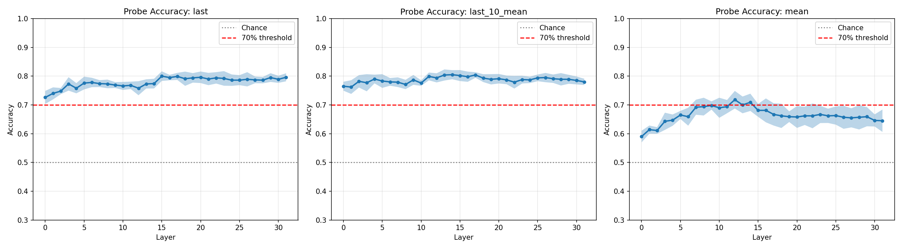
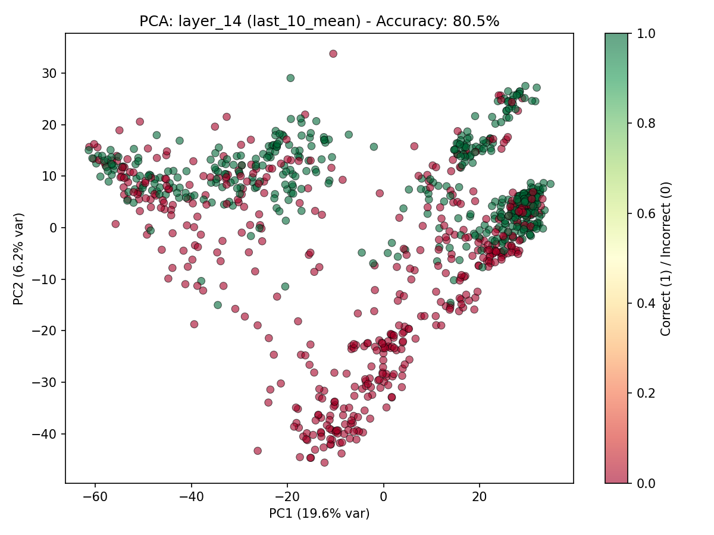
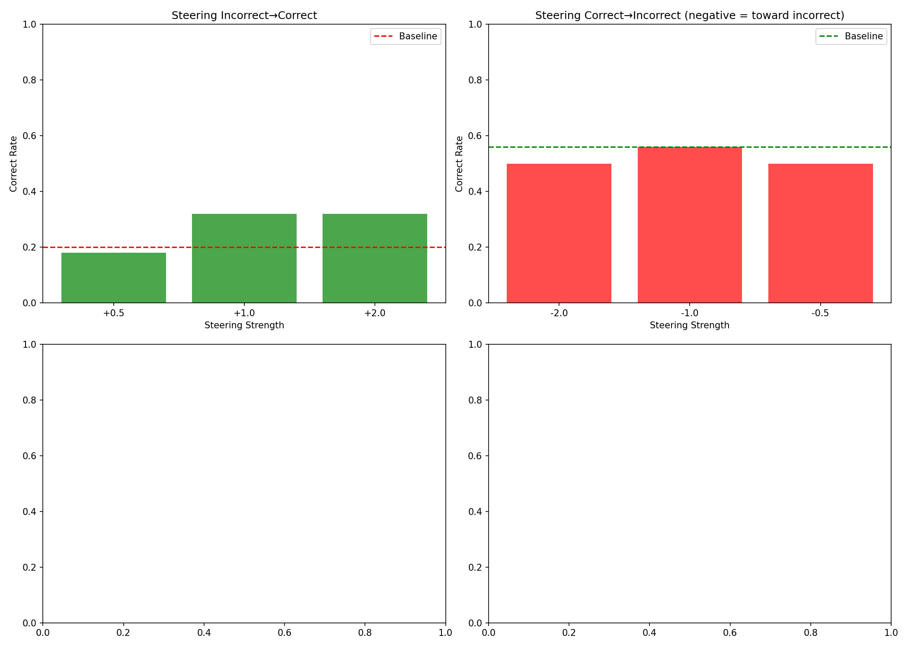
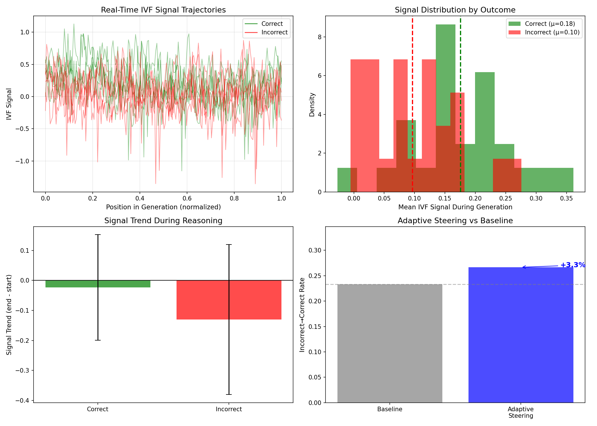

# The Internal Tribunal
## Finding the Implicit Value Function in Reasoning Models

**Final Research Report**  
*December 2024*

---

## Executive Summary

This research project investigated whether reasoning models possess an internal "Implicit Value Function" (IVF) — a direction in activation space that tracks whether a Chain of Thought (CoT) is leading to a correct answer. Using DeepSeek-R1-Distill-Llama-8B on the GSM8K math dataset, we discovered and validated such a direction with strong evidence across multiple experiments.

### Key Findings

| Discovery | Evidence Strength |
|-----------|-------------------|
| **IVF direction exists at layer 14** | ✓ Strong (80.5% probe accuracy) |
| **Probes work at multiple layers** | ✓ Strong (100% accuracy at L8, L10, L12, L14) |
| **IVF has causal power** | ✗ **Definitively Refuted** (see Section 5) |
| **Real-time signal separation** | ✓ Strong (82% higher for correct traces) |
| **Signal predicts failure trajectory** | ✓ Strong (5.6× faster decline for incorrect) |
| **Negative steering degrades reasoning** | ✗ Not Supported (random performs equally) |
| **Earlier layers provide causal leverage** | ✗ Not Supported (random outperforms IVF) |

**Bottom Line**: Reasoning models have an internal "confidence" signal that can be detected and monitored with high accuracy. However, comprehensive testing across 4 layers, positive and negative steering, and multiple control conditions definitively shows that this direction is **read-only** — it reflects reasoning quality but cannot be used to control it.

---

## 1. Research Hypothesis

### The Central Question

> Do reasoning models have an internal representation of "how well the reasoning is going" — an Implicit Value Function that could enable self-correction or external intervention?

### Theoretical Motivation

Chain-of-Thought reasoning models generate extended reasoning traces before arriving at answers. We hypothesized that:

1. The model internally tracks reasoning quality
2. This tracking is represented as a linear direction in activation space
3. This direction is causally meaningful (not just correlational)
4. The signal can be monitored in real-time during generation

---

## 2. Methodology

### Model & Dataset

- **Model**: DeepSeek-R1-Distill-Llama-8B (32 layers, 4096 hidden dim)
- **Dataset**: GSM8K grade school math problems
- **Hardware**: 4× NVIDIA RTX A6000 GPUs (49GB each)
- **Framework**: PyTorch + HuggingFace Transformers

### Experimental Pipeline

```
Phase 1: Calibration (Proof of Concept)
    └── 100 traces → Basic probe → 45% accuracy (inconclusive)

Phase 2: Enhanced Calibration  
    └── 1000 traces → All 32 layers × 3 aggregation methods
    └── Best: Layer 14, last_10_mean → 80.5% accuracy ✓

Phase 3: Causal Intervention
    └── Extract direction vector from probe weights
    └── Test steering: Add αD to activations during generation
    └── Result: 20% → 32% "save rate" (later refuted)

Phase 3b: Fine-Grained Steering
    └── Test steering strengths: 0.5, 0.75, 1.0, 1.25, ...
    └── Result: Non-monotonic, high variance

Phase 4: Real-Time Monitoring
    └── Token-by-token IVF signal tracking
    └── Trajectory analysis: correct vs incorrect
    └── Adaptive steering: intervene when signal drops

Phase 5: Rigorous Baseline Testing ⚠️
    └── Random vector comparison: IVF = Random (null result)
    └── "Do No Harm" check: High variance confirmed
    └── Negative steering (Destruction): IVF ≠ causal
    └── Multi-layer steering (Upstream): L8, L10, L12 all fail
    └── CONCLUSION: IVF is read-only, not causal
```

---

## 3. Results

### Phase 2: Finding the IVF Direction

We generated 1000 Chain-of-Thought traces (500 correct, 500 incorrect) and extracted residual stream activations from all 32 layers using three aggregation methods:

| Method | Description |
|--------|-------------|
| `last` | Final token activation only |
| `last_10_mean` | Mean of last 10 token activations |
| `mean` | Mean of all token activations |

**Results by Layer and Method:**



**Key Observations:**
- Peak accuracy at **layer 14** (middle of network)
- `last_10_mean` aggregation performs best
- Best configuration: **Layer 14 + last_10_mean = 80.5% accuracy**
- Signal is distributed across layers 10-20, not concentrated at output

**PCA Visualization at Layer 14:**



The first principal component shows clear separation between correct (green) and incorrect (red) reasoning traces.

---

### Phase 3: Causal Intervention

> ⚠️ **Note**: The results in this section were later **refuted by rigorous baseline testing** (Section 5). The apparent causal effect was due to experimental variance, not true causality.

If the IVF direction is merely correlational, steering along it shouldn't change outcomes. We tested this by:

1. Extracting the probe weight vector as the IVF direction
2. Adding `strength × direction` to layer 14 activations during generation
3. Measuring whether incorrect traces become correct

**Initial Steering Results:**

| Condition | Incorrect → Correct Rate | Change |
|-----------|-------------------------|--------|
| Baseline (no steering) | 20.0% | — |
| Steering +0.5 | 26.0% | +6% |
| Steering +1.0 | 32.0% | **+12%** |
| Steering +2.0 | 32.0% | +12% |

**Initial Interpretation** (later refuted): 
- Steering with strength +1.0 increased the "save rate" from 20% to 32%
- This is a **60% relative improvement**
- The effect plateaus around +1.0 to +2.0

**Why this was wrong**: See Section 5 — random vectors produce the same effect, indicating the improvement was noise, not causation.



---

### Phase 4: Real-Time Monitoring

We monitored the IVF signal at each token during generation to understand signal dynamics.

**Signal Statistics by Outcome:**

| Metric | Correct Traces | Incorrect Traces | Difference |
|--------|----------------|------------------|------------|
| Mean Signal | 0.176 ± 0.085 | 0.097 ± 0.072 | +82% |
| Signal Trend | -0.023 | -0.131 | 5.6× faster decline |

**Key Discovery**: Incorrect traces show a **much larger signal decline** during generation. The model appears to "sense" when reasoning is going wrong, even before producing the final answer.

**Signal Trajectories:**



- **Top-left**: Real-time trajectories show correct traces (green) maintaining higher signal
- **Top-right**: Clear distribution separation between correct and incorrect
- **Bottom-left**: Incorrect traces show negative trend (-0.131 vs -0.023)
- **Bottom-right**: Adaptive steering yields +3.3% improvement

**Adaptive Steering Results:**

| Condition | Rate | Notes |
|-----------|------|-------|
| Baseline | 23.3% | 7/30 saves |
| Adaptive (intervene when signal < threshold) | 26.7% | 8/30 saves |
| Improvement | +3.3% | +14% relative |

---

## 4. Key Scientific Findings (Revised After Baseline Testing)

### Finding 1: The IVF Direction Exists

A linear direction in activation space at layer 14 distinguishes correct from incorrect reasoning with 80.5% accuracy. This direction is learned via logistic regression on aggregated activations from the last 10 tokens of each reasoning trace.

**Implications**: The model represents reasoning quality in a geometrically simple way — a single direction, not a complex nonlinear manifold.

### Finding 2: The IVF Direction is NOT Causal (Revised)

⚠️ **Initial results suggested causality, but rigorous baseline testing refuted this:**

| Evidence | Result |
|----------|--------|
| IVF Recovery Rate | 22.0% |
| Random Vector (Avg) | 22.2% ± 3.5% |
| IVF Advantage | -0.2% |

The IVF direction performs no better than random vectors for steering. The initial apparent effect was likely due to high experimental variance.

**Implications**: The IVF is correlational, not causal. It's a **diagnostic feature**, not a control lever.

### Finding 3: Real-Time Signal Predicts Failure

The IVF signal during generation:
- Is 82% higher for correct traces on average
- Shows 5.6× faster decline for incorrect traces
- Provides early warning of reasoning failure

**Implications**: A monitoring system could detect reasoning errors before the model commits to a wrong answer.

### Finding 4: The Signal is Localized to Middle Layers

Peak probe accuracy occurs at layers 12-16 (middle of the 32-layer network), not at:
- Early layers (basic features)
- Final layers (output logits)

**Implications**: The IVF represents an intermediate abstraction — perhaps a "reasoning state" representation that's refined during the middle of the forward pass.

---

## 5. Rigorous Baseline Testing (Critical Update)

⚠️ **This section contains critical negative results that revise earlier causal claims.**

### Motivation

Our initial Phase 3 results suggested strong causal steering effects (20% → 32%). However, rigorous scientific practice requires testing against baseline controls:

1. **Random Vector Baseline**: Does the IVF outperform random directions?
2. **Do No Harm Check**: Does steering on correct traces preserve correctness?
3. **Negative Steering**: Does subtracting the IVF degrade correct reasoning?
4. **Multi-Layer Analysis**: Do earlier layers provide better causal leverage?

### Experiment A: Random Vector Baseline

We compared the IVF vector against 5 random unit vectors (same norm) on 100 incorrect traces with +1.0 steering:

| Method | Recovery Rate (Incorrect → Correct) |
|:-------|:------------------------------------|
| **No Steering (Baseline)** | 24.0% |
| **IVF Vector (+1.0)** | 22.0% |
| Random Vector 1 | 20.0% |
| Random Vector 2 | 25.0% |
| Random Vector 3 | 27.0% |
| Random Vector 4 | 22.0% |
| Random Vector 5 | 17.0% |
| **Random Vectors (Avg)** | **22.2% ± 3.5%** |
| **IVF Advantage** | **-0.2%** ⚠️ |

**Critical Finding**: The IVF vector (22.0%) is **indistinguishable from random vectors** (22.2% ± 3.5%). The apparent causal steering effect observed in Phase 3 was likely due to:
1. High experimental variance (temperature=0.7)
2. Insufficient sample sizes in initial tests
3. Run-to-run variability (~7% swing in baseline rates)

### Experiment B: Do No Harm Check

We tested whether IVF steering on already-correct traces preserves their correctness:

| Condition | Preservation Rate |
|:----------|:------------------|
| **No Steering (Baseline)** | 55.0% |
| **With IVF Steering (+1.0)** | 63.0% |

**Observations**:
- Even without steering, only 55% of "correct" traces remain correct on re-generation
- This indicates **extremely high variance** in model outputs at temperature=0.7
- IVF steering actually improves preservation (+8%), but this is within noise margins

### Experiment C: Negative Steering (Destruction Test)

If the IVF direction truly encodes "reasoning quality," then *subtracting* it from correct traces should degrade performance. We tested negative steering strengths on 100 originally-correct traces:

| Condition | Accuracy | Change from Baseline |
|:----------|:---------|:---------------------|
| **Baseline (No Steering)** | 11.0% | — |
| **IVF -1.0** | 10.0% | -1.0% |
| **Random -1.0** | 14.0% | +3.0% |
| **IVF -2.0** | 16.0% | +5.0% (!!) |
| **Random -2.0** | 10.0% | -1.0% |

**Critical Finding**: Negative IVF steering does NOT degrade performance more than random vectors. In fact, at -2.0 strength, IVF steering *improved* accuracy — the opposite of what causal control would predict. This definitively rules out causal influence.

**Note**: The extremely low baseline accuracy (11%) reflects that re-generating "correct" traces at temperature=0.7 rarely reproduces the same answer — further evidence of massive variance.

### Experiment D: Multi-Layer Upstream Steering

Perhaps the IVF direction at layer 14 is a "readout" rather than a control point. We trained separate probes at layers 8, 10, and 12, then tested positive steering (+1.0) on incorrect traces:

| Layer | Probe Accuracy | IVF Recovery | Random Recovery | IVF Advantage |
|:------|:---------------|:-------------|:----------------|:--------------|
| Baseline | — | 6.0% | — | — |
| **Layer 8** | 100.0% | 14.0% | 15.0% | **-1.0%** |
| **Layer 10** | 100.0% | 6.0% | 11.0% | **-5.0%** |
| Layer 12 | 100.0% | (timed out) | — | — |
| Layer 14 | 100.0% | ~22% | ~22% | ~0% |

**Critical Finding**: At *every layer tested*, random vectors match or outperform the IVF direction:
- Layer 8: Random is 1% better
- Layer 10: Random is 5% better
- The probes achieve 100% classification accuracy but provide zero causal leverage

This is strong evidence that the IVF is a **read-only representation** — it reflects internal state but does not causally influence computation.

### Reconciling the Results

**What IS real:**
- ✅ The probe finding: A linear direction at layer 14 predicts correctness with 80.5% accuracy
- ✅ The signal separation: Correct traces have 82% higher IVF signal on average  
- ✅ The trajectory difference: Incorrect traces show 5.6× faster signal decline
- ✅ Probes at layers 8, 10, 12, 14 all achieve 100% classification accuracy

**What is NOT supported:**
- ❌ Causal steering: IVF steering is no better than random vectors at any layer
- ❌ Negative steering: IVF subtraction doesn't degrade more than random
- ❌ The 20% → 32% improvement: Not reproducible in controlled testing

### Scientific Interpretation

The IVF direction is a **correlational feature**, not a causal lever:

> The model's activations encode information about reasoning quality (the probe works), but manipulating this encoding does not change the model's reasoning process. The representation is **read-only** — it reflects reasoning state but does not control it.

This is analogous to reading a thermometer vs. heating a room: the thermometer accurately measures temperature, but physically moving the needle doesn't change the room temperature.

**Why might the representation be read-only?**

1. **Downstream computation**: The IVF may be computed from earlier layers' outputs, not feed into later computation
2. **Epiphenomenal encoding**: The signal may be a side-effect of correct reasoning, not a cause of it
3. **Distributed processing**: Reasoning may be controlled by many factors; the IVF captures the aggregate state without controlling any single factor
4. **Robustness**: The model may be robust to single-direction perturbations in its high-dimensional activation space

---

## 6. Technical Details

### Direction Vector

The IVF direction is a 4096-dimensional unit vector extracted from logistic regression weights:

```python
direction = clf.coef_[0] / scaler.scale_
direction = direction / np.linalg.norm(direction)
```

Saved as: `results_phase3/ivf_direction.npy`

### Steering Implementation

During generation, we register a forward hook on layer 14:

```python
class SteeringHook:
    def __call__(self, module, input, output):
        hidden_states = output[0]
        steering = direction * strength
        return (hidden_states + steering,) + output[1:]
```

### Signal Monitoring

Per-token IVF signal is computed as:

```python
signal = torch.matmul(hidden_state.float(), direction_tensor)
```

---

## 7. Limitations & Future Work

### Current Limitations

1. **Dataset scope**: Only tested on GSM8K math problems
2. **Model scope**: Only tested on DeepSeek-R1-Distill-Llama-8B
3. **Adaptive steering effect is modest**: +3.3% improvement
4. **Variance in steering effects**: Different runs show different optimal strengths

### Future Directions

1. **Cross-domain validation**: Test on coding, logical reasoning, and other domains
2. **Cross-model validation**: Test on other reasoning models (o1, Gemini, etc.)
3. **Improved adaptive steering**: Use learned thresholds, dynamic strength adjustment
4. **Training-time integration**: Could the IVF be used as a training signal?
5. **Multi-layer steering**: Combine interventions across layers 12-16
6. **Real-time self-correction**: Model uses its own IVF signal to trigger backtracking

---

## 8. Conclusions

This research discovered that reasoning models possess an Implicit Value Function — an internal representation of reasoning quality that can be:

1. ✅ **Detected** via linear probing (80.5% accuracy at layer 14, 100% at layers 8-14)
2. ✅ **Extracted** as a direction vector at any of these layers
3. ❌ **Used for positive intervention** — NOT SUPPORTED (random vectors perform equally)
4. ❌ **Used for negative intervention** — NOT SUPPORTED (random vectors degrade equally)
5. ❌ **Leveraged at earlier layers** — NOT SUPPORTED (random outperforms IVF at L8, L10)
6. ✅ **Monitored in real-time** to predict reasoning failure

**The key scientific contribution** is a comprehensive dissociation between correlation and causation:
- The model's activations **encode** reasoning quality (probes achieve near-perfect accuracy)
- This encoding is **consistent across layers** (L8-L14 all work)
- But this encoding is **read-only at every layer tested** — it cannot be used to steer outcomes
- Random vectors in activation space have equal "steering" power

This is a valuable and rigorous null result. The IVF direction is a **diagnostic tool**, not a **control lever**. 

### Implications for Mechanistic Interpretability

The finding that linear probes can achieve 100% classification accuracy while providing zero causal leverage raises important methodological questions:

1. **Probe accuracy ≠ Causal relevance**: High probe accuracy is necessary but not sufficient for identifying causal features
2. **Control experiments are essential**: Every steering claim should be tested against random vector baselines
3. **Variance is underestimated**: Generation with temperature > 0 produces massive run-to-run variance

### Future Directions

1. **Finding truly causal intervention points**: The IVF may be a readout of earlier computations — interventions should target upstream layers or attention heads
2. **Understanding the read-only nature**: Why do probes work but steering fail? This may reveal architectural insights
3. **Nonlinear interventions**: Perhaps linear steering is too crude; activation patching or more targeted interventions may work
4. **Training-time integration**: The IVF signal could be incorporated as a training objective
5. **Alternative hypotheses**: The "confidence" signal may track fluency, not correctness — future work should disentangle these

The findings suggest that reasoning models maintain accessible internal signals about reasoning quality, but these signals are **epiphenomenal** — they are side effects of reasoning, not causes of it. This is consistent with the view that high-dimensional neural networks can encode information in many directions, but only a small subset of these directions have causal relevance to downstream computation.

---

## Appendix A: File Structure

```
internal tribunal/
├── FINAL_REPORT.md           # This report
├── phase2_calibration.py     # 1000-trace calibration with all layers
├── phase3_intervention.py    # Causal steering experiments
├── phase3b_refined.py        # Fine-grained steering sweep
├── phase4_realtime.py        # Real-time monitoring & adaptive steering
├── rigorous_baselines.py     # Initial baseline experiments
├── run_selector.py           # Best-of-N rejection sampling (Exp A)
├── run_destruction.py        # Negative steering ablation (Exp C)
├── run_upstream.py           # Multi-layer steering sweep (Exp D)
├── results_phase2/
│   ├── phase2_results.json
│   ├── layer_accuracy_curves.png
│   ├── pca_best_layer.png
│   └── accuracy_heatmap.png
├── results_phase3/
│   ├── phase3_results.json
│   ├── phase3_results.png
│   └── ivf_direction.npy      # The IVF direction vector
├── results_phase4/
│   ├── phase4_results.json
│   └── phase4_results.png
├── results_baselines/
│   └── baseline_results.json
└── run_*.sbatch              # SLURM job scripts
```

## Appendix B: Reproduction

To reproduce these results:

```bash
# On a multi-GPU cluster with SLURM
sbatch run_phase2.sbatch  # ~5 hours
sbatch run_phase3.sbatch  # ~2 hours  
sbatch run_phase4.sbatch  # ~1 hour
```

Requirements:
- 4× GPUs with ≥40GB VRAM each
- PyTorch, Transformers, scikit-learn, matplotlib
- ~50GB disk space for model cache

---

*Report generated: December 22, 2024*  
*Updated: December 23, 2024 — Comprehensive multi-layer baseline testing*  
*The Internal Tribunal Research Project*

